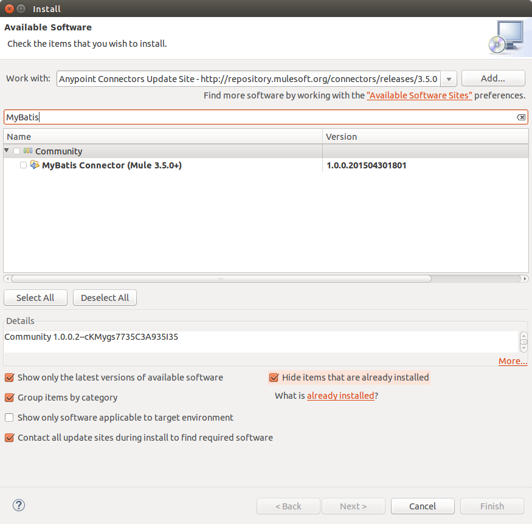

= MyBatis Connector

---

== Contents:

. Introduction
.. Prerequisites
.. Requirements
.. Dependencies

. Installing & Configuring
.. Installing
.. Configuring

. See Also

---

== Introduction 

When the ESB becomes part of the core of your architecture, high availability is a must. This means that more than one instance will form part of the deployment; if one instance goes down, the other one will carry on with its job.

If Mule is being used to handle synchronous flows only, like HTTP requests, it is enough to have multiple Mule instances deployed next to each other. Each instance is then completely independent.

Unfortunately, this is not always the case. If you have asynchronous flows with shared resources (for example, your inbound endpoint is FTP), scaling horizontally becomes an issue. If two Mule instances are deployed and both are configured to read from the same FTP location, the same file can be read by both instances and hence the same message can be processed twice. The same will happen if the flows are kicked by a poller; the two Mule instances will be independent and each will have its own poller, resulting in the flow being executed on each and every node.

Moreover, with independent instances, load cannot be shared between the instances unless there are external load balancers in place. Also, data such as object stores cannot be shared between the instances.

The motivation behind MyBatis Clustering is to solve these shortcomings and provide high availability effectively for both synchronous and asynchronous applications.

=== Prerequisites

This document assumes that you are familiar with Mule, http://www.mulesoft.org/documentation/display/35X/Anypoint+Connectors[Anypoint™ Connectors], and the http://www.mulesoft.org/documentation/display/35X/Anypoint+Studio+Essentials[Anypoint™ Studio interface]. To increase your familiarity with Studio, consider completing one or more http://www.mulesoft.org/documentation/display/35X/Basic+Studio+Tutorial[Anypoint™ Studio Tutorials]. Further, this page assumes that you have a basic understanding of http://www.mulesoft.org/documentation/display/current/Mule+Concepts[Mule flows] and http://www.mulesoft.org/documentation/display/current/Global+Elements[Mule Global Elements]. 

=== Requirements

* http://www.mulesoft.org/documentation/display/current/Hardware+and+Software+Requirements[Hardware and Software Requirements]

=== Dependencies

Supported Mule Runtime Versions: 3.6.x

---

== Installing and Configuring 

=== Installing

You can "test drive" the MyBatis connector by installing it on Anypoint™ Studio. Follow the instructions to http://www.mulesoft.org/documentation/display/current/Download+and+Launch+Anypoint+Studio[download and launch Anypoint™ Studio], then follow the steps below to install the connector.

To install the MyBatis connector in Anypoint Studio:

. Under the *Help* menu in Anypoint™ Studio, select *Install New Software*.
+

. On the *Install* wizard, click the drop-down arrow for the *Work with:* field, then select the Anypoint™ Connector update site.
+

. In the table below the *Filter* field, click to expand the *Community* folder, and click the check box for *MyBatis Connector (Mule 3.5.0+)*. Click *Next*.
+

. In Install Details, click *Next*.
. In Review Licenses, review the license text, and click *I accept the terms of the license agreement*. Click *Finish*. The connector installs.
. At the end of the installation, click *Yes* to restart Anypoint Studio. After Anypoint Studio restarts, the MyBatis connector appears in the list of connectors.
+

=== Configuring

To use the MyBatis connector, you must configure:

* A global MyBatis element for use by all the MyBatis connectors in an application.
- _Anypoint™ Studio Visual Editor_
. Click the *Global Elements* tab at the base of the canvas, then click *Create*.
. In the *Choose Global Type* menu, use the filter to locate and select *MyBatis*, then click *OK*.
. Configure the parameters according to the table below.
+
|===
|Parameter 						|Description

|*Name*							|Enter a name for the configuration so it can be referenced later.
|*Config File*				|Enter a reference to MyBatis configuration file
|*Sql Session Factory Reference*		|Enter a SqlSessionFactory to use to create sessions.
|===
+

- _Anypoint™ Studio XML Editor_
+
Create a global MyBatis configuration outside and above your flows, using the following global configuration code. Ensure that you include the MyBatis namespaces in your configuration file.
+
[source,xml]
----
<mule xmlns:mybatis="http://www.mulesoft.org/schema/mule/mybatis"
	xmlns="http://www.mulesoft.org/schema/mule/core"
	xmlns:doc="http://www.mulesoft.org/schema/mule/documentation"
	xmlns:spring="http://www.springframework.org/schema/beans" version="EE-3.6.2"
	xmlns:xsi="http://www.w3.org/2001/XMLSchema-instance"
	xsi:schemaLocation="http://www.springframework.org/schema/beans http://www.springframework.org/schema/beans/spring-beans-current.xsd
http://www.mulesoft.org/schema/mule/core http://www.mulesoft.org/schema/mule/core/current/mule.xsd
http://www.mulesoft.org/schema/mule/mybatis http://www.mulesoft.org/schema/mule/mybatis/current/mule-mybatis.xsd">
    <mybatis:config name="MyBatis" configFile="dfg" sqlSessionFactory-ref="fdgh" doc:name="MyBatis"/>
</mule>

----

* Parameters of each MyBatis connector instance in the application flows.
. Drag the MyBatis connector onto the canvas, and double-click it to open the Properties Editor console.
. Configure these parameters for the connector:
+
|===
|Field						|Description

|*Display Name*				|Enter a unique label for the connector in your application.
|*Connector Configuration*		|Connect to a global element linked to this connector. Global elements encapsulate reusable data about the connection to the target resource or service. Select the global MyBatis connector element that you just created.
|*Operation*				|Select the action this component must perform.
|===
+
NOTE: Refer to the list of supported operations and their descriptions in the ApiDoc http://mulesoft.github.com/mule-module-mybatis/[here].
 
---
=== See Also

 * Access full reference documentation for the connector http://ricston.com/blog/rant-mule-jdbc-transport-introduction-mule-module-mybatis/[here].
